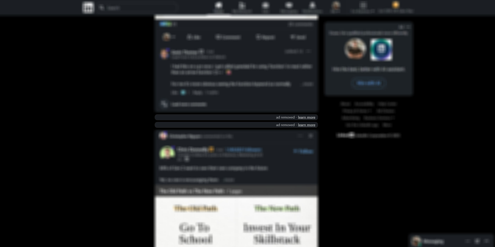
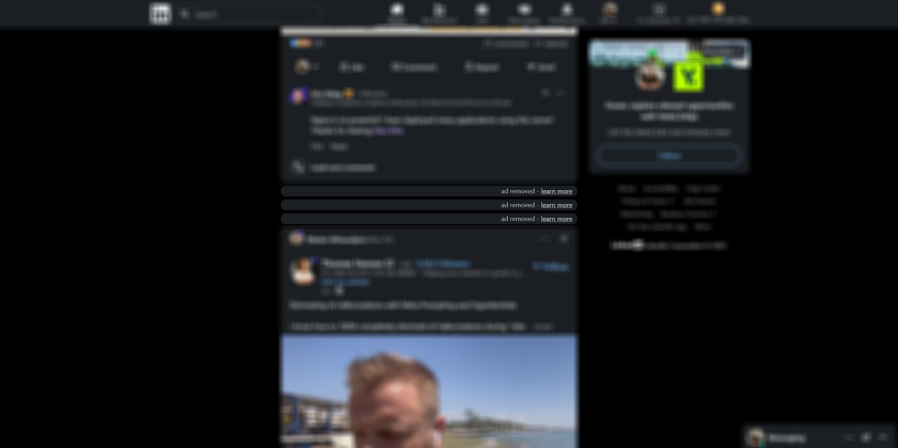

# LinkedIn Feed Cleaner

Remove LinkedIn ads and distractions for a cleaner, faster, and more focused experience.

Tired of sponsored posts cluttering your feed? LinkedIn Feed Cleaner hides ads, suggested content, and other noise - so you can focus on what matters.

---

## ✨ Features
- 🛡 Removes ads – Hide sponsored posts and promoted content.
- 🚀 Speeds up browsing – Less clutter means a faster LinkedIn.
- 🎯 Stay focused – No more distractions in your professional feed.
- 💡 Lightweight & private – No data tracking. No sign-ups. No nonsense.
- 🛠 100% free & open‑source – Built for the community.

---

## 📷 Screenshots
Below are examples of ads removed and the cleaned feed view:

First image: two ads removed.

Second image: three ads removed.

---

## ✅ Compatibility
- Chromium-based browsers: Google Chrome, Microsoft Edge, Brave, Opera.
- Manifest Version: v3.
- Scope: Works on `www.linkedin.com`.

Note: The current detection looks for the "Promoted" label (English UI). Other locales may require updates.

---

## 📦 Installation

### From Chrome Web Store
Coming soon. Once published, you will be able to install it directly from the Chrome Web Store.

### Manual Installation (Developer mode)
1. Download the source ZIP: click the green Code button on this repository, then Download ZIP.
2. Extract the `.zip` file.
3. Open `chrome://extensions` (or `edge://extensions`, `brave://extensions`).
4. Enable Developer mode.
5. Click "Load unpacked" and select the extracted folder (the folder containing `manifest.json`).

---

## 🔍 How it works
- The content script scans for the "Promoted" label and finds the surrounding post container.
- The ad post is cleared and replaced with a small, unobtrusive placeholder indicating it was removed.
- A MutationObserver keeps your feed clean as new posts load.
- No API calls. No network requests. No data collected.

---

## 🔐 Permissions
Declared in `manifest.json`:
- `activeTab`
- `scripting`

Notes:
- The extension runs only on `www.linkedin.com` via a content script.
- No external requests are made, and no data leaves your browser.

---

## 🛡 Privacy
We value your privacy. LinkedIn Feed Cleaner does not track, store, or share your data. All processing happens locally in your browser.

---

## 🧑‍💻 Development
1. Clone the repo: `git clone https://github.com/duxor/linkedIn-feed-cleaner.git`
2. Open your Chromium browser’s Extensions page and load the project folder as an unpacked extension.
3. Edit `content.js` and refresh the extension (click Reload) to test changes.

### Package for the Chrome Web Store
- Create a ZIP of the extension directory that contains `manifest.json`, `content.js`, and assets (e.g., icons).
- Ensure no unnecessary files (like node_modules or large assets) are included.

---

## 🧩 Troubleshooting
- Not working? Make sure you’re on `www.linkedin.com` and the UI language shows the "Promoted" label. Try refreshing the page.
- If LinkedIn changes its UI, open an issue with a screenshot or HTML snippet so we can update selectors.
- Disable/enable the extension or click Reload on the Extensions page after updating.

---

## 💬 Contributing
Contributions are welcome!
- Open an issue: https://github.com/duxor/linkedIn-feed-cleaner/issues
- Submit a pull request

---

## 📜 License
MIT License – free to use, modify, and distribute.

---

## ⭐ Support the project
If you find LinkedIn Feed Cleaner helpful:
- Star ⭐ this repository
- Share it with your network

Stay focused. Stay productive. Clean your LinkedIn feed today.
